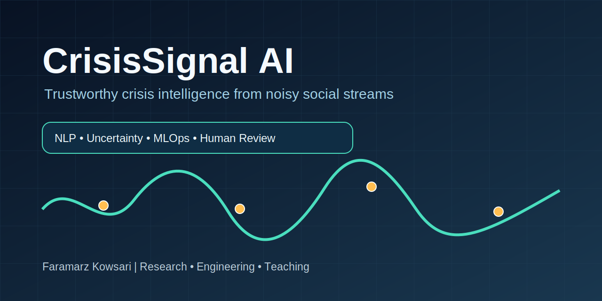
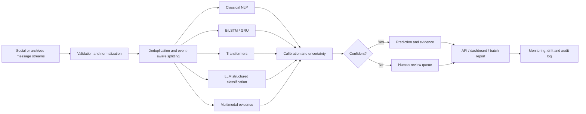

# CrisisSignal AI

<p align="center">
  
</p>

**Trustworthy, multilingual and multimodal crisis intelligence from noisy social streams.**

[](https://github.com/FaramarzKowsari/crisis-signal-ai/actions/workflows/ci.yml)
[](https://www.python.org/)
[](LICENSE)
[](https://docs.astral.sh/ruff/)
[](https://doi.org/10.5281/zenodo.21459117)

> **Repository status:** portfolio-grade engineering foundation with a reproducible classical NLP baseline, calibrated abstention, REST API, command-line interface, monitoring utilities, tests, Docker support, documentation, and extension points for recurrent, transformer, LLM and multimodal research.

CrisisSignal AI began as a graduate deep-learning assignment for the University of Colorado Boulder. The original LSTM notebook is preserved under [`legacy/`](legacy/) for academic provenance. The project has since been redesigned as an end-to-end research and engineering platform for decision support during disasters and humanitarian crises.

## Why this project matters

Messages posted during a crisis are noisy, duplicated, multilingual, emotionally charged and frequently incomplete. A useful system must do more than maximize accuracy. It must identify relevant messages, estimate uncertainty, abstain when evidence is weak, preserve provenance, support human review and remain reproducible across events.

CrisisSignal AI is designed around five principles:

1. **Strong baselines before large models.** TF-IDF and linear models remain essential reference points.
2. **Risk-aware decisions.** The system can return `review` instead of forcing a brittle prediction.
3. **Reproducibility.** Data splits, parameters, artifacts and evaluation reports are explicit.
4. **Human oversight.** The software is decision support, not an autonomous emergency authority.
5. **Honest evidence.** Reported legacy metrics are clearly separated from reproduced results.

## Implemented capabilities

- Duplicate-aware train/test splitting to reduce text leakage.
- TF-IDF + class-balanced logistic-regression baseline.
- Probability calibration metrics and Expected Calibration Error.
- Configurable abstention band for human-review routing.
- Batch and single-message inference through FastAPI.
- Typer-based CLI for training, evaluation, prediction and demo-data generation.
- Population Stability Index and token-distribution drift utilities.
- Provider-neutral structured-output prompt and parser for LLM experiments.
- Optional TensorFlow BiLSTM reference implementation.
- Optional Hugging Face transformer fine-tuning adapter.
- Image hashing and perceptual-deduplication utilities for multimodal extensions.
- Docker, GitHub Actions, CodeQL, pre-commit and MkDocs configuration.

## Architecture



## Quick start

```bash
git clone https://github.com/FaramarzKowsari/crisis-signal-ai.git
cd crisis-signal-ai
python -m venv .venv
source .venv/bin/activate  # Windows: .venv\Scripts\activate
pip install -e ".[dev,api]"
```

Create a small safe demonstration dataset, train the baseline and make a prediction:

```bash
crisis-signal make-demo-data --output data/demo.csv
crisis-signal train --data data/demo.csv --output artifacts/baseline.joblib
crisis-signal predict --model artifacts/baseline.joblib \
  "Bridge collapsed after the earthquake; ambulances are requested."
```

Run the API:

```bash
export CRISIS_SIGNAL_MODEL=artifacts/baseline.joblib
uvicorn crisis_signal.api:app --host 0.0.0.0 --port 8000
```

Example request:

```bash
curl -X POST http://localhost:8000/v1/predict \
  -H "Content-Type: application/json" \
  -d '{"text":"Flood water has entered the hospital basement."}'
```

## Data

No restricted dataset is committed to this repository. See [`data/README.md`](data/README.md) for supported schemas, licensing notes and acquisition instructions. The original Kaggle competition data must be obtained through Kaggle after accepting its rules.

Expected minimum columns:

| column | type | required | meaning |
|---|---:|:---:|---|
| `text` | string | yes | message content |
| `target` | integer | yes | `1` disaster-related, `0` not disaster-related |
| `id` | string/integer | no | source identifier |
| `event_id` | string | no | event grouping for cross-event evaluation |
| `language` | string | no | BCP-47 or short language code |

## Evaluation policy

A model is not promoted by accuracy alone. The default report includes:

- accuracy, precision, recall and F1;
- macro F1 and confusion matrix;
- Brier score and Expected Calibration Error;
- coverage and selective accuracy after abstention;
- cost-weighted error with a higher penalty for false negatives;
- data fingerprint and split metadata.

The legacy notebook reported approximately **0.757 accuracy**, **0.700 recall** and **0.722 precision**. These values are retained as historical evidence and are **not presented as reproduced benchmark results**. See [`benchmarks/results.csv`](benchmarks/results.csv).

## Repository map

```text
src/crisis_signal/        reusable Python package
apps/                     dashboard entry points
scripts/                  dataset and benchmark utilities
tests/                    unit and API tests
configs/                  reproducible experiment settings
docs/                     architecture, ethics and research documentation
benchmarks/                evidence registry and comparison tables
book/                      companion-book metadata and chapter map
legacy/                    original Colorado Boulder assignment
.github/workflows/         CI, security and documentation automation
```

## Companion book

**Engineering Trustworthy Crisis Intelligence: From Noisy Social Streams to Multilingual, Multimodal and Human-in-the-Loop Disaster AI**

Reserved DOI: **10.5281/zenodo.21459117**

The DOI belongs to the companion book, not to the software repository. A separate Zenodo DOI should be minted for the software after the first tagged release. Book-to-code mappings are maintained in [`book/outline.md`](book/outline.md).

## Responsible-use statement

This project is a research and educational system. It must not be used as the sole basis for emergency dispatch, medical triage, evacuation orders, law-enforcement action or public-warning decisions. Predictions can be wrong, biased, stale or manipulated. High-impact use requires domain experts, verified data sources, operational security, privacy review and human authorization.

## Citation

See [`CITATION.cff`](CITATION.cff). The companion-book BibTeX entry is available in [`book/citation.bib`](book/citation.bib).

## Author

**Faramarz Kowsari** — author, software engineer and AI researcher based in Istanbul.

- GitHub: https://github.com/FaramarzKowsari
- ORCID: https://orcid.org/0000-0003-1692-0453
- Google Scholar: https://scholar.google.com/citations?user=G7tP5WMAAAAJ&hl=en
- Wikidata: https://www.wikidata.org/wiki/Q140389378

## License

Source code is released under the [MIT License](LICENSE). Dataset licenses and platform terms remain separate and must be respected.
