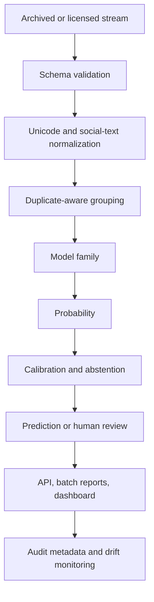

# Architecture



## Boundaries

The package separates model code from data acquisition, API serving and user interfaces. Optional heavy dependencies are isolated. The default installation remains lightweight and testable on a CPU.

## Artifact contract

A serialized artifact contains:

```python
{"pipeline": fitted_sklearn_pipeline, "metadata": reproducibility_metadata}
```

Metadata includes the dataset fingerprint, split parameters, software versions and risk-aware evaluation report.
